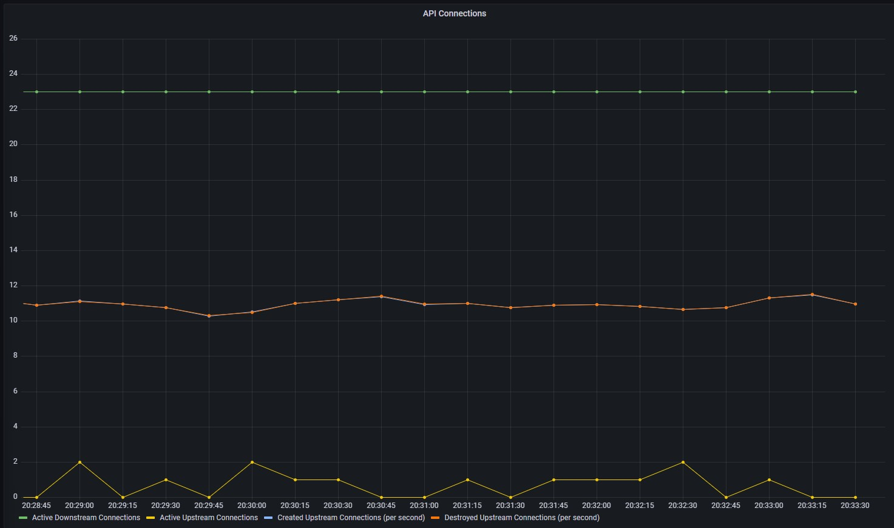

<TerminalVisor minimized="true">
  <Terminal target="tools.container.shipyard.run" shell="/bin/bash" workdir="/" user="root" id="tools" name="Tools"/>
</TerminalVisor>

Let's examine connection metrics, in Envoy connection metrics are related to the Listener, if you remember back from the 
introduction a Listener in Envoy is an open port bound to a specific address that accepts connections, generally forwarding
to an upstream cluster.

## Common Connection Metrics
In this section we will learn how to query envoys metrics to understand the current number of active connections, the number
of connections opened per second, and the number of connections closed per second. We are going to use the following metrics. 

| Name                  | Type    | Description                 |
| --------------------- | ------- | -----------------           |
| downstream_cx_active  | Gauge   | Total active connections    |
| downstream_cx_total   | Counter | Total connections           |
| downstream_cx_destroy | Counter | Total destroyed connections |

The chart you are going to create will look something like the following, and will show the downstream connections to the `API` service
along with the upstream connections from the `API` service to the `Payments` service.

#### Figure 1.0 API Connections


### Downstream Connections

To query statistics using Grafana and Prometheus you can use the Explore feature, if you are using Instruqt you can switch to
this tab in your browser.

In the `Metrics browser` box enter the text `envoy_http_downstream_cx_active`, as you type Grafana will autocomplete the 
metrics names that Prometheus has available to it.

You can also change the time period that you would like to use when querying the data, choose 5 minutes from the box in the 
top right corner.

You should see data that looks something like the following:

#### Figure 1.1 API Active Downstream Connections


You will see that there are a number of different metrics displayed, these are from many different services and listeners.
To see the data for the image that we would like to use we can filter the returned metrics using the tags that are attached to 
the metrics.

If you press `space` inside the brackets for the metric `envoy_http_downstream_cx_active{}` grafana will start to autocomplete
the tags that are available. Let's add the tag `service` and set the value to `api`, and also lets filter further by
setting the `envoy_listener_address` to the value `envoy_listener_address=~".*_20000"`.

Note that in the last value you are using a regular expression `.*_20000` to use a tag value that matches everything up to 
the value `_20000`

The listener address is set by Envoy and contains the ip and port, of the listener, for example `10.42.0.26_20000`, depending
on your particular service mesh different tags will probably be used. With Consul the public listener for a service
is by default listening on port `20000` so we can use this to filter our metrics.

You should have query that looks something like the following.  

```javascript
envoy_listener_downstream_cx_active{service="api", envoy_listener_address=~".*_20000"}
```

You should also see that there are approximately `20` active connections split over 3  workers. These are the main worker which is
used for coordination and a number of worker threads that are controlled by the `--concurrency` option.

<p><a href="https://www.envoyproxy.io/docs/envoy/latest/configuration/listeners/stats#per-handler-listener-stats" target="_blank">
https://www.envoyproxy.io/docs/envoy/latest/configuration/listeners/stats#per-handler-listener-stats
</a></p>

For our example we can add an additional filter `envoy_worker_id=""` to only show us the main thread.

The metric `envoy_listener_downstream_cx_active` is a Gauge that means it is a snapshot value at the point in time when the data was scraped.
What this indicates is that there is a stable connection pool of `20` connections to the API service from the Ingress.

### Creating a new dashboard

Let's now add this to the dashboard. In the `Grafana Dashboards` tab click the `New Dashboard` button, your new dashboard should open
showing the `Add panel` UI. Next click `Add New Panel`, to add a new panel to Grafana.

#### Figure 1.2 New Dashboard


Add the below query to the `Metrics browser` box.

```javascript
envoy_listener_downstream_cx_active{service="api", envoy_listener_address=~".*_20000", envoy_worker_id=""}
```

Then in the `Legend` add a description, this is the active downstream connections for the API service so let's add that to the legend.

```
Active Downstream Connections
```

Finally, add a title `API Connections`, you should have something that looks like the following.

#### Figure 1.3 API Connections


### Upstream Connections 

Let's now take a look at the upstream connections from the API service to the `Payments` service, figure 1.4 shows the flow of traffic 
between API and the Payments service.  `API` does not make a direct connection to `Payments`, instead this traffic is routed through the 
envoy proxy. To facilitate this communication Envoy generally has an additional listener that is designed to forward these requests.

#### Figure 1.4 Envoy Upstreams


To get the active connections for these upstreams you can use the same metric as before, however a different listener address needs
to be used.

```javascript
envoy_listener_downstream_cx_active{service="api", envoy_listener_address=~"???", envoy_worker_id=""}
```

Determining this value is dependent upon how your service mesh configures Envoy to tag it's listeners, however, it is also a 
good time to delve into some Envoy configuration to do a little metrics archeology.

Envoy's configuration can be retrieved by making a request to the admin port at the path `config_dump`. In our setup the admin port is running
at port `19000`, if you run the following command you will see all of the Envoy configuration dumped to the terminal for the `api-deployment`.

<TerminalRunCommand target="tools">
  <Command>clear</Command>
  <Command>kubectl exec deployment/api-deployment curl localhost:19000/config_dump | jq</Command>
</TerminalRunCommand>

```shell
kubectl exec deployment/api-deployment curl localhost:19000/config_dump | jq
```

This shows the full config from Envoy which can be a little overwhelming, we can use a little JQ foo to filter this and
only return a subset of the `dyanmic_listeners`.

<TerminalRunCommand target="tools">
  <Command>clear</Command>
  <Command>kubectl exec deployment/api-deployment -c api curl localhost:19000/config_dump | jq '.configs[] | select(. | has("dynamic_listeners")) | .dynamic_listeners[] | &#123;name, listener: .active_state.listener.address, config: .active_state.listener.filter_chains[].filters[].typed_config.route_config}'</Command>
</TerminalRunCommand>

```shell
kubectl exec api-deployment-6fcb485bc5-hdffv -c api \
  curl localhost:19000/config_dump | \
    jq '.configs[] |
    select(. | has("dynamic_listeners")) |
    .dynamic_listeners[] |
      {name, listener: .active_state.listener.address, 
       config: .active_state.listener.filter_chains[].filters[].typed_config.route_config
      }'
```

Running this query you should be able to filter out that the `Payments` listener is at address `127.0.0.1` and port `15001`.

```json
{
  "name": "outbound_listener:127.0.0.1:15001",
  "listener": {
    "socket_address": {
      "address": "127.0.0.1",
      "port_value": 15001
    }
  },
  "config": {
    "name": "payments",
    "virtual_hosts": [
      {
        "name": "payments.default.default.dc1",
        "domains": [
          "*"
        ],
        "routes": [
          {
            "match": {
              "prefix": "/"
            },
            "route": {
              "cluster": "payments.default.dc1.internal.c1915cce-5df8-35d5-5a79-e7c84404546d.consul"
            }
          }
        ]
      }
    ]
  }
}
```

You can now use this to query the metrics for Payments connections. Add another query to your dashboard using the `+ Query` button and add the
following metric.

```javacscript
envoy_listener_downstream_cx_active{job="api", envoy_listener_address="127.0.0.1_15001", envoy_worker_id=""}
```

You can also set the Legend `Active Upstream Connections`.

What you should see is something like the following, note that the connections to the `Payments` service are not constant like the inbound
connections to the API service. This is probably because there is not a consistent connection pool and conections are constantly being
opened and closed. Since we know this is a HTTP restful service we are going to assume that every request is creating a TCP connection.
We will see later how we can get granular metrics for requests, but, for now, lets see how we can see opened and closed connections.

#### Figure 1.5 Active Upstream Connections


### Opened and Closed Connections

Let's now see how we can query another two metrics to determine the open and closed connections. This time you are going to use the
following metric.

```javascript
envoy_listener_downstream_cx_total
```

This metric is counter, it increments every time a new connection is opened.

#### Challenge

As a challenge, create a new Query in your dashboard and add the total connections for the payments listener.

<details>
  <summary>Answer</summary>

The filters are the same as the query that you used earlier, the main difference is that you are using
`envoy_listener_downstream_cx_total` metric instead of the `envoy_listener_downstream_cx_active` metric.
```javascript
envoy_listener_downstream_cx_total{job="api", envoy_listener_address="127.0.0.1_15001", envoy_worker_id=""}
```
</details>

We mentioned earlier that the metric `envoy_listener_downstream_cx_total` is a counter, that means it increases over time. Displaing 
a counter in this way is not particularly useful for our purpose. What we would like to see is the number of connections that are opened
per second.

#### Figure 1.5 Total Upstream Connections


To see this you need to use the prometheus function `rate`. `rate` calculates the per-second increase of your metric.
You always use rate with a time range such as `60s`. Metrics are not stored as individual samples but as an aggregation, Envoy only reports 
the current aggregated value.

Run the following command in the terminal to see the raw metrics from Envoy that is scraped by Prometheus.

<TerminalRunCommand target="tools">
  <Command>clear</Command>
  <Command>kubectl exec deployment/api-deployment curl localhost:19000/stats/prometheus | grep envoy_listener_downstream_cx_total</Command>
</TerminalRunCommand>

```shell
kubectl exec deployment/api-deployment curl localhost:19000/stats/prometheus | grep envoy_listener_downstream_cx_total
```

The cardinality or the number or data points that Prometheus stores is based on how frequently it scrapes this data. In the current
setup we are scraping every `30 seconds` so we can not calculate a rate with a duration of anything less than this interval. 

Update your query to add the `rate` function and display this on your dashboard. 

```javascript
rate(envoy_listener_downstream_cx_total{job="api", envoy_listener_address="127.0.0.1_15001", envoy_worker_id=""}[$__rate_interval])
```

:::note
The above query does not use an absolute duration instead it uses `[$__rate_interval]`. `$__rate_interval` is not a PromQL 
parameter. It is actually a Grafana variable, that is guaranteed to be four times the scrape interval. The purpose is to simplify
building charts meaning you do not have to specify the duration every time.

<a href="https://grafana.com/blog/2020/09/28/new-in-grafana-7.2-__rate_interval-for-prometheus-rate-queries-that-just-work/">
https://grafana.com/blog/2020/09/28/new-in-grafana-7.2-__rate_interval-for-prometheus-rate-queries-that-just-work/
</a>
:::

When you update your chart you will see that the total connections are increasing by approximately `12 per second`.
Graphing this data is important for two reasons:

1. A pod can only sustain a finite number of connections before it runs out of the file descriptors that are used for sockets. 
  Continually increasing connections that are not being closed is a sign of a badly behaving or misconfigured system.
2. Connections that are continually being opened and closed may not be as efficient as using a connection pool. Every time a connection
  is opened Envoy needs to do a mTLS handshake. Where possible it is far more efficient to reuse connections rather than open and close them.  

#### Figure 1.6 Total Upstream Connections Per Second


Let's validate that the connections are being closed. To do that you can use the `envoy_listener_downstream_cx_destroy{}` metric.

```
envoy_listener_downstream_cx_destroy{job="api", envoy_listener_address="127.0.0.1_15001", envoy_worker_id=""}
```

#### Challenge

Write a query that adds destroyed connections per second to your dashboard.

:::note
`envoy_listener_downstream_cx_destroy{}` is a counter, it also does not have `Per-handler Listener Stats` and therfore
does not have the tag `envoy_worker_id`.
:::

<details>
  <summary>Answer</summary>

You should have written a query that looks like the following:

```javascript
rate(envoy_listener_downstream_cx_destroy{job="api", envoy_listener_address="127.0.0.1_15001"}[$__rate_interval])
```
</details>

If you got your query correct you should see the connections created per send and the connections destroyed per second
mirroring each other. 

#### Figure 1.7 Destroyed Upstream Connections Per Second



Whenever you see something like this for a HTTP API, it is safe to assume that a new connection is
being consumed per request. In the next section we will validate this hypothesis by delving into Envoys HTTP request
metrics.

Before we do, don't forget to save your dashboard, we are going to create a new panel for HTTP requests.

### Envoy Listener Statistics
A full list of Envoy listener statistics can be found at the link below, why not spend 5 minutes taking a look
at some of the other metrics that are avaialable for an Envoy listener.

<a href="https://www.envoyproxy.io/docs/envoy/latest/configuration/listeners/stats#listener-manager" target="_blank">
https://www.envoyproxy.io/docs/envoy/latest/configuration/listeners/stats#listener-manager
</a>

<p style={{height: "400px"}}></p>
