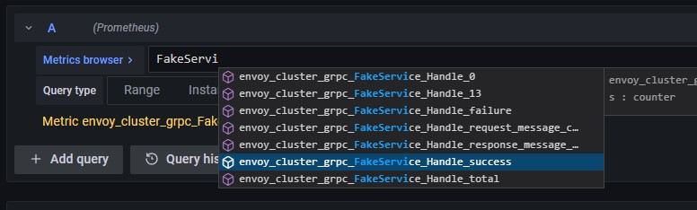
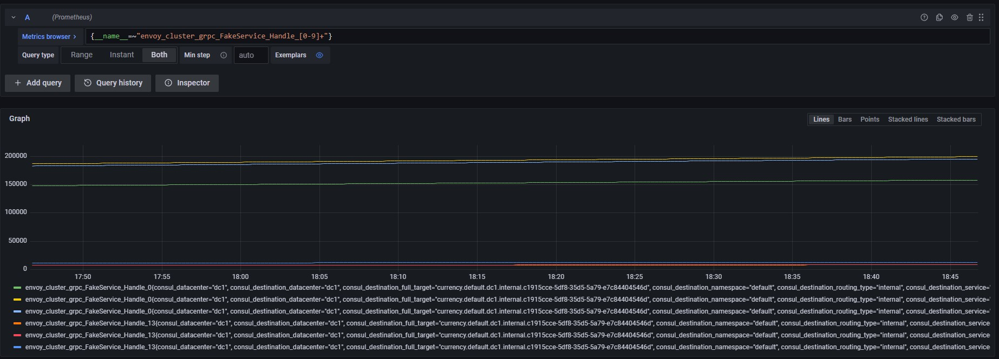
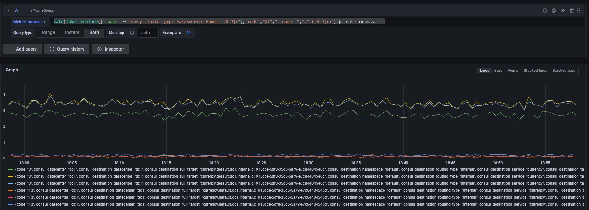
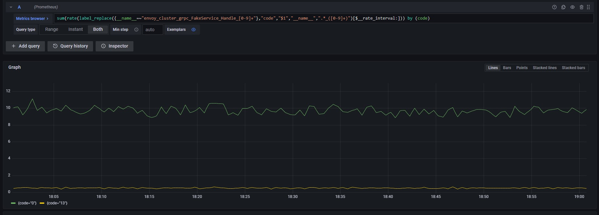

<TerminalVisor minimized="true">
  <Terminal target="tools.container.shipyard.run" shell="/bin/bash" workdir="/" user="root" id="tools" name="Tools"/>
</TerminalVisor>

Let's now take a look at querying a gRPC service, the `Currency` service that is called by the Payments service
is a gRPC service. To enable detailed metrics for gRPC services the Envoy filter gRPC Statistics can be 
configured for the listener.

<p>
<a href="https://www.envoyproxy.io/docs/envoy/latest/configuration/http/http_filters/grpc_stats_filter">
https://www.envoyproxy.io/docs/envoy/latest/configuration/http/http_filters/grpc_stats_filter
</a>
</p>

```json
"http_filters": [
  {
    "name": "envoy.filters.http.grpc_stats",
    "typed_config": {
      "@type": "type.googleapis.com/envoy.extensions.filters.http.grpc_stats.v3.FilterConfig",
      "stats_for_all_methods": true
    }
  }
```

This filter ensures that detailed statistics for each gRPC Service and Method are reported along with 
their gRPC error codes.


## Common gRPC Metrics

gRPC metrics are reported slightly differently to the downstream metrics that you used earlier. The metrics are named based
on their service and name. For example `envoy_cluster_grpc_FakeService_Handle_0` is the metric that reports status code `ok` or `0`
for the method `Hander` in the service `FakeService` for the `Currency` API.

| Name                  | Type    | Description                 |
| --------------------- | ------- | -----------------           |
| service.method.success | Counter | Total successful service/method calls |
| service.method.failure | Counter | Total failed service/method calls |
| service.method.total | Counter | Total service/method calls |
| service.method.request_message_count | Counter | Total request message count for service/method calls |
| service.method.response_message_count | Counter | Total response message count for service/method calls |
| service.method.upstream_rq_time | Histogram | Request time milliseconds |

Let's write a query that shows the gRPC error codes for the Currency API.

## gRPC Requests per Second

If you click on the Grafana browser and start to type `FakeService` you will see the auto complete show a number of metrics.
Unlike the http request metrics the response code is not a tag but is part of the metric name. This could pose problems when 
graphing the data as you would need to add an entry for each individual error code.

#### Figure 3.0 Metrics Browser



We can however write some clever PromSQL that will alow us to query all the metrics and extract the error code into a tag.

The first thing you need to do is to graph the data using a regular expression instead of the metric name. Every metric in 
PromSQL can be queried by it's metric name or as a generic metric using the tag `__name__`. The following example shows 
how you can do this and use a regular expression to do this.

```javascript
{__name__=~"envoy_cluster_grpc_FakeService_Handle_[0-9]+"}
```

You should see something like the following:

#### Figure 3.1 FakeService Handle Method



What you need to do with this is to extract the gRPC error code that is part of the `__name__` and add this as a label.
To do that you can use the PromQL function `label_replace`.

<a href="https://prometheus.io/docs/prometheus/latest/querying/functions/#label_replace">
https://prometheus.io/docs/prometheus/latest/querying/functions/#label_replace
</a>

The label replace function looks like this.

`label_replace(metric, label_to_add, regex_match, label_to_search, search_regex)`

If you enter this in your metrics browser you will see that the code that is the prefix from the metric has been extracted
and added as the label `code`.

These gRPC statistics are also a `Counter` to display these as method calls per second you need to add the `rate` function.

```
rate(label_replace({__name__=~"envoy_cluster_grpc_FakeService_Handle_[0-9]+"},"code","$1","__name__",".*_([0-9]+)")[$__rate_interval:])
```

:::note
When you use the `label_replace` function you need to convert the returned set back into a vector before you can apply the rate function.
Adding an additional `:` to the duration for the rate forces Prometheus to perform a sub query and return the correct vector.
:::

Your graph should now be looking something like the following:

#### Figure 3.1 FakeService Handle Method per Second



Since Payments consists of multiple pods there is a series for each error code and each pod. You can group these using the `sum` function.

### Challenge

Add the `sum` function to your query to group by `code`

<details>
  <summary>Answer</summary>

You should have written a query that looks like the following:

```javascript
sum(rate(label_replace({__name__=~"envoy_cluster_grpc_FakeService_Handle_[0-9]+"},"code","$1","__name__",".*_([0-9]+)")[$__rate_interval:])) by (code)
```

</details>

Your final query should create a graph that looks like the following example:

#### Figure 3.1 Grouped Method calls per Second



## gRPC Request Timing

You have now seen how to get detailed statistics for method call status, but what about timings? There are no specific gRPC statistics
for method call timings. Instead you have to leverge a feature of the gRPC Filter.

:::note
By default, the router filter will emit translated HTTP status code stats (from the cluster namespace) for gRPC requests.

<a href="https://www.envoyproxy.io/docs/envoy/latest/configuration/http/http_filters/grpc_stats_filter">
https://www.envoyproxy.io/docs/envoy/latest/configuration/http/http_filters/grpc_stats_filter
</a>
:::

This means that there will be the equivalent HTTP request statistic for all gRPC method calls, you can therefore use the 
metric `envoy_cluster_upstream_rq_time_bucket` to report method timings.

### Challenge

Add a new Panel that shows the 50%, 90% and 95% timings for the Currency service.

<details>
  <summary>Answer</summary>

You should have written three queries that looks like the following:

```javascript
histogram_quantile(0.5, sum(rate(envoy_cluster_upstream_rq_time_bucket{consul_service="currency"}[$__rate_interval])) by (le))
histogram_quantile(0.9, sum(rate(envoy_cluster_upstream_rq_time_bucket{consul_service="currency"}[$__rate_interval])) by (le))
histogram_quantile(0.95, sum(rate(envoy_cluster_upstream_rq_time_bucket{consul_service="currency"}[$__rate_interval])) by (le))
```

</details>

In this section you have learned how to report gRPC services, in the next you will learn how to report some basic reliability 
patterns like a retries.
