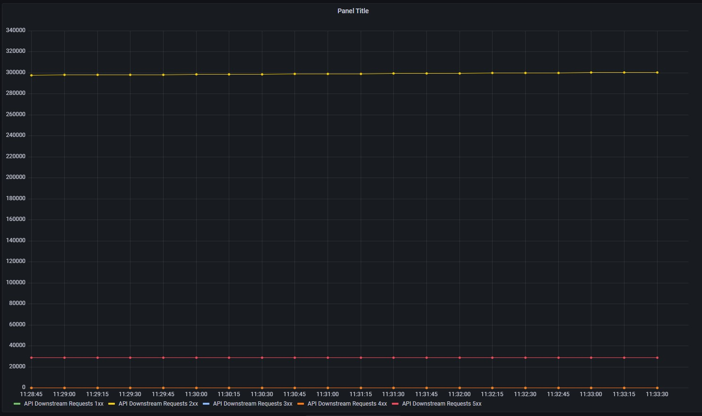
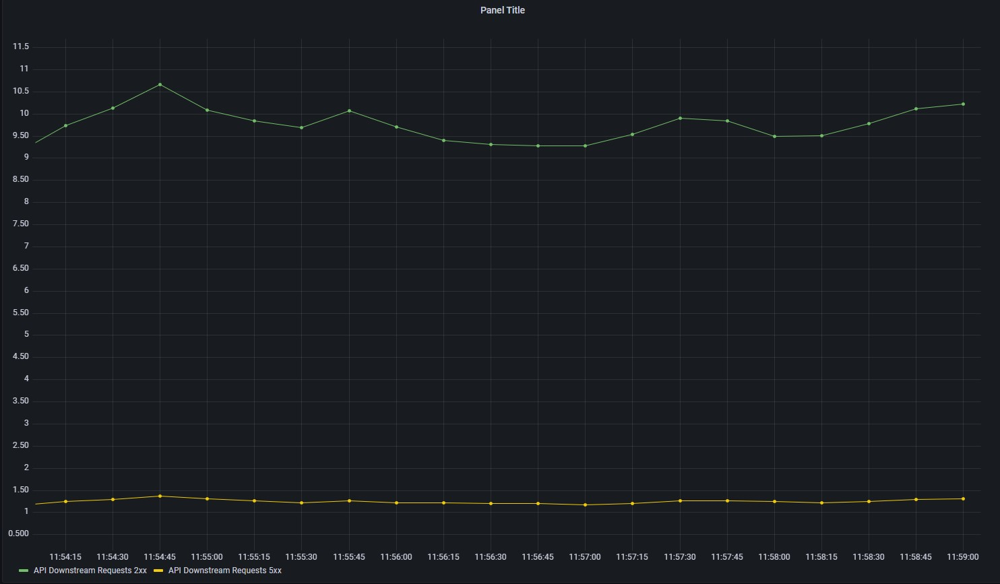
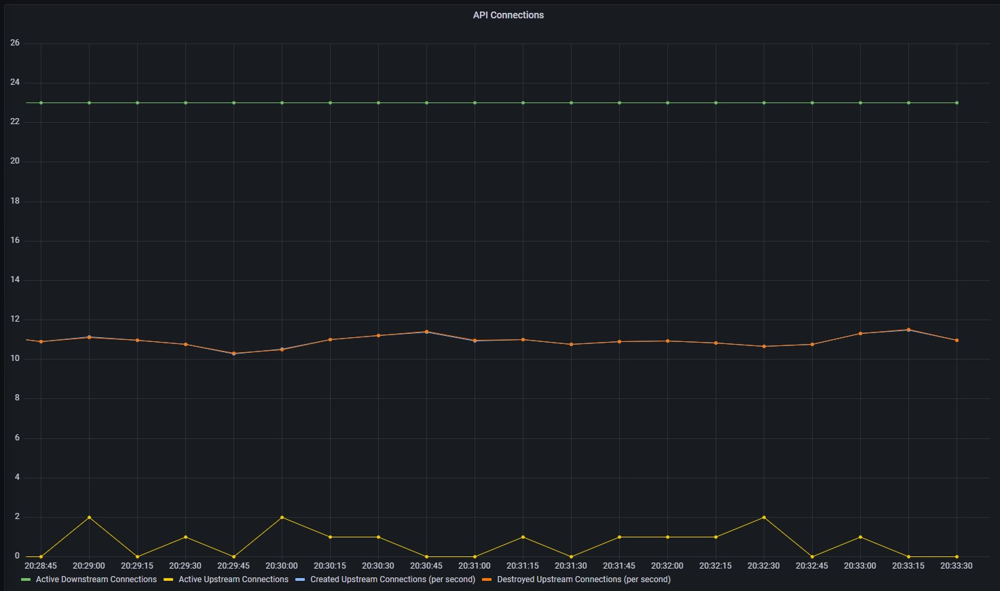
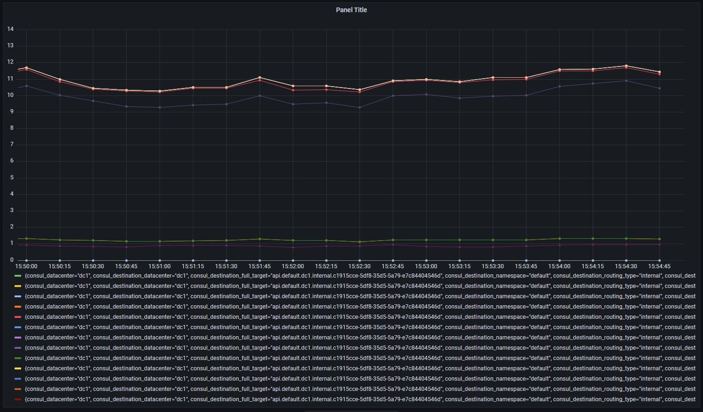
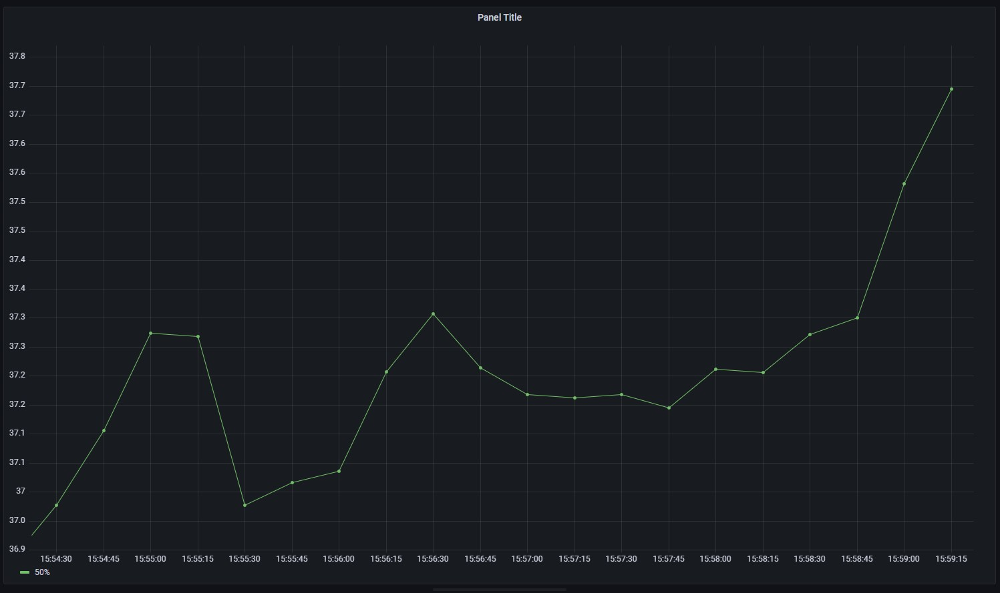
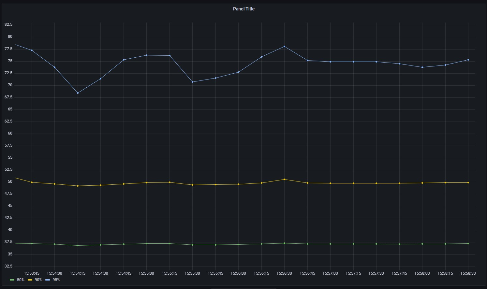

import Tabs from '@theme/Tabs';
import TabItem from '@theme/TabItem';

<TerminalVisor minimized="true">
  <Terminal target="tools.container.shipyard.run" shell="/bin/bash" workdir="/" user="root" id="tools" name="Tools"/>
</TerminalVisor>

In the last part you learned how to query for connections, however connections operate at a Layer 4, you will not be able
to understand if your application is functioning correctly unless Envoy understands the application protocol.

For Envoy to emit detailed application specific protocol metrics the Listener needs to be configured with
a network filter.  Envoy supports many different network filters such as:

* HTTP (including gRPC)
* Kafka
* Mongo
* MySQL
* Postgres

Generally Envoy is configured by your service mesh's control pane. You only need to configure the protocol using your 
service meshes specific configuration.

<Tabs>
  <TabItem value="istio" label="Istio" default>

```yaml
kind: Service
metadata:
  name: myservice
spec:
  ports:
  - port: 3306
    name: database
    appProtocol: https
  - port: 80
    name: http-web
```
</TabItem>
  <TabItem value="consul" label="Consul" default>

```yaml
apiVersion: consul.hashicorp.com/v1alpha1
kind: ServiceDefaults
metadata:
  name: payments
spec:
  protocol: http
```
  </TabItem>
</Tabs>

This roughly translates to the following configuration. The presence of this filter is all Envoy needs to start emitting metrics for HTTP
requests.

```json
{
  "name": "envoy.filters.network.http_connection_manager",
  "typed_config": {
    "@type": "type.googleapis.com/envoy.extensions.filters.network.http_connection_manager.v3.HttpConnectionManager",
    "stat_prefix": "public_listener",
    "route_config": {
      "name": "public_listener",
      "virtual_hosts": [
        {
          "name": "public_listener",
          "domains": [
            "*"
          ],
          "routes": [
            {
              "match": {
                "prefix": "/"
              },
              "route": {
                "cluster": "local_app"
              }
            }
          ]
        }
      ]
    }
  }
}
```

## Downstream Requests

An important metric to consider is `envoy_listener_http_downstream_rq_xx`, this records the HTTP response that is returned to the calling client.
Any errors that occur but are masked by a rety are not reported in this metric, it is only the response that is returned.

```javascript
envoy_listener_http_downstream_rq_xx
```

Let's create a new panel in the dashboard and add this metric for the API service, since this metric covers many listeners, like connections
you need to filter it. The two fitlers that you can use are `envoy_http_conn_manager_prefix="public_listener"` to select the public listener
and then `consul_source_service="api"` to select the `api`. Depending on which service mesh you are using, different tags will be added
to the metrics. When querying a metric in Grafana or directly in Prometheus you will see all the tags so you can choose the appropriate one.

Add the following to your dashboard:

```javascript
envoy_listener_http_downstream_rq_xx{envoy_http_conn_manager_prefix="public_listener", consul_source_service="api"}
```

You should see multiple data points even though you have filtered things to only select the public listener for the api service.
This is due to envoy reporting the different response code classes (2xx, 3xx, 4xx, etc) with their own tag. We want to display
each status code as an individual line so this is perfect. However, we also need to see this in the legend. Grafana allows you to use 
a tag as a variable in the Legend.

In the legend, enter the following information.

```
API Downstream Requests {{envoy_response_code_class}}xx
```

Your chart should look something like the following:

### Figure 2.1 API Downstream requests


The reason you are seeing a large number of request is not because there is a large amount of traffic, but, `envoy_listener_http_downstream_rq_xx` is a `Counter`.

### Challenge

Try applying the `rate` function like you did with connections to show the requests per second.

<details>
  <summary>Answer</summary>

You should have written a query that looks like the following:

```javascript
rate(envoy_listener_http_downstream_rq_xx{envoy_http_conn_manager_prefix="public_listener", consul_source_service="api"}[$__rate_interval])
```
</details>

You will note that there are lines for 1xx and 4xx that do not contain any data. Let's see how we can clear that up and only show things that
have data.

To do this all you need to do is to add `!=0` to the end of your query. Your final graph should looks something like the following.

### Figure 2.2 API Downstream requests, 2xx and 5xx


If you remember back from the connections examples we built a hypothesis that the connections were being created and destroyed
per request. Looking at the number of requests per second for the API it is looking like that theory stands. 

#### Figure 2.3 Destroyed Upstream Connections Per Second



Let's now confirm this hypothesis by charting the upstream requests to the payments service from API. The metric you will need to use is
`envoy_cluster_upstream_rq`. 

### Challenge

Try building a query that shows the upstream requests per second for the payments service. Don't forget to add the Legend.

<details>
  <summary>Answer</summary>

You should have written a query that looks like the following:

```
rate(envoy_cluster_upstream_rq{consul_source_service="api", consul_destination_service="payments"}[$__rate_interval])
```

</details>

Your query for upstreams should mirror those for the downstream requests, this is because for every request to API there is an upstream request to Payments.

Apply your changes to save your panel, we are now going to see how we can plot the request latency for the API service.

## Request Latency

Request latency is generally represented by a Histogram metric, there are buckets for different request durations each reporting a count 
of requests that match that bucket. Run the following command in the terminal to take a look at the raw data that Envoy reports for upstream
requests.

<TerminalRunCommand target="tools">
  <Command>clear</Command>
  <Command>kubectl exec deployment/api-deployment -c api curl localhost:19000/stats/prometheus | grep envoy_cluster_upstream_rq_time_bucket</Command>
</TerminalRunCommand>

```
kubectl exec deployment/api-deployment -c api curl localhost:19000/stats/prometheus | grep envoy_cluster_upstream_rq_time_bucket
```

You will see something similar to the output below.

```javascript
envoy_cluster_upstream_rq_time_bucket{local_cluster="api", le="0.5"} 0
envoy_cluster_upstream_rq_time_bucket{local_cluster="api", le="1"} 0
envoy_cluster_upstream_rq_time_bucket{local_cluster="api", le="5"} 0
envoy_cluster_upstream_rq_time_bucket{local_cluster="api", le="10"} 0
envoy_cluster_upstream_rq_time_bucket{local_cluster="api", le="25"} 2915
envoy_cluster_upstream_rq_time_bucket{local_cluster="api", le="50"} 2915
envoy_cluster_upstream_rq_time_bucket{local_cluster="api", le="100"} 2915
envoy_cluster_upstream_rq_time_bucket{local_cluster="api", le="250"} 2915
envoy_cluster_upstream_rq_time_bucket{local_cluster="api", le="500"} 2915
envoy_cluster_upstream_rq_time_bucket{local_cluster="api", le="1000"} 2915
envoy_cluster_upstream_rq_time_bucket{local_cluster="api", le="2500"} 2915
envoy_cluster_upstream_rq_time_bucket{local_cluster="api", le="5000"} 2915
envoy_cluster_upstream_rq_time_bucket{local_cluster="api", le="10000"} 2915
envoy_cluster_upstream_rq_time_bucket{local_cluster="api", le="30000"} 2915
envoy_cluster_upstream_rq_time_bucket{local_cluster="api", le="60000"} 2915
envoy_cluster_upstream_rq_time_bucket{local_cluster="api", le="300000"} 2915
envoy_cluster_upstream_rq_time_bucket{local_cluster="api", le="600000"} 2915
envoy_cluster_upstream_rq_time_bucket{local_cluster="api", le="1800000"} 2915
envoy_cluster_upstream_rq_time_bucket{local_cluster="api", le="3600000"} 2915
envoy_cluster_upstream_rq_time_bucket{local_cluster="api", le="+Inf"} 2915
```

Histograms are also stored as a Counter so to chart them you need to add the `rate` function. Add the following metric to a new panel.

```javascript
rate(envoy_cluster_upstream_rq_time_bucket{consul_service="api"}[$__rate_interval])
```

You should see something like the following. 

#### Figure 2.3 API Requests Duration



This chart is not particularly what you are actually showing is the counts per second for each of the buckets, not the time taken
for each request.  To show this you need to use a specific Prometheus function `histogram_quantile`, this function calculates the quartile 
from the buckets of a histogram. 

<a href="https://prometheus.io/docs/prometheus/latest/querying/functions/#histogram_quantile">
https://prometheus.io/docs/prometheus/latest/querying/functions/#histogram_quantile
</a>

To display the median or 50 percentile values for your request duration you can use the following query.

```javascript
histogram_quantile(0.5, rate(envoy_cluster_upstream_rq_time_bucket{consul_service="api"}[$__rate_interval]))
```

#### Figure 2.5 API Requests Duration 50%



Looking at the 50% is useful to track the long term performance of your system but it does not really show you any outliers. Outliers that are
present a large difference to the 50% could be dramatically influencing the median and therefore affecting performance. Therefore when looking at
latency you should also consider the outliers such as 90% and 95%.

### Challenge

Add two new queries to your panel to show the 90% and 95% values.

<details>
  <summary>Answer</summary>

You should have written a query that looks like the following:

```javascript
histogram_quantile(0.9, rate(envoy_cluster_upstream_rq_time_bucket{consul_service="api"}[$__rate_interval]))
histogram_quantile(0.95, rate(envoy_cluster_upstream_rq_time_bucket{consul_service="api"}[$__rate_interval]))
```

</details>

#### Figure 2.5 API Requests Duration 50%, 90%, 95%



In this section you have seen how to report individual request data for HTTP services. In the next section you will learn how
report this data for gRPC services.

### Envoy Connection Manager Statistics
A full list of statistics that are available for the Envoy HTTP Connection Manager can be found at the following location.
Why not spend 5 minutes taking a look at some of these statistics.

<a href="https://www.envoyproxy.io/docs/envoy/latest/configuration/http/http_conn_man/stats">
https://www.envoyproxy.io/docs/envoy/latest/configuration/http/http_conn_man/stats
</a>

<p style={{height: "400px"}}></p>
