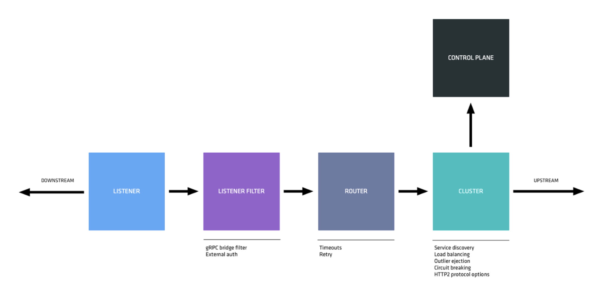
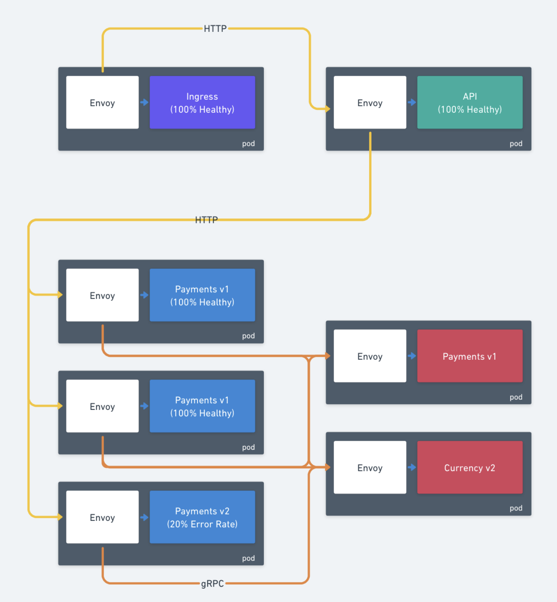

<TerminalVisor minimized="true">
  <Terminal target="tools.container.shipyard.run" shell="/bin/bash" workdir="/" user="root" id="tools" name="Tools"/>
</TerminalVisor>

In this workshop you will learn the fundamentals of Envoy metrics and
how you can use them to gain insights into your Service Mesh applications.

This demo uses Consul Service Mesh, however, all the information is
applicable to any Envoy based Service Mesh such as Istio, Kong, Traefik,
OSM, etc.

:::note
It is possible to configure metrics in Envoy in a number of different
ways. The examples in this workshop may not be directly translatable to
another Service Mesh, but, the concepts and Envoy topology is.
:::

## Envoy Topology

When a request flows through Envoy it passes through the components
showing in figure 1.0. When trying to determine which Envoy statistic
is relevant, it is helpful to understand this topology.

#### Figure 1.0 Request Flow


### Listener
A listener is a named network location (e.g., port, unix domain socket, etc.) that can be connected to by downstream clients. Envoy exposes one or more listeners that downstream hosts connect to.

### Downstream
A downstream host connects to Envoy, sends requests, and receives responses.

### Upstream
An upstream host sends requests from Envoy to other services and returns responses.

### Cluster
A cluster is a group of logically similar upstream hosts that Envoy connects to. Envoy discovers the members of a cluster via service discovery. The cluster member that Envoy routes a request to is determined by the load balancing policy.

## Example Application

The example application that we are going to use for the workshop is a 
three tier application comprised of HTTP and gRPC services.

### API
The API layer is the main entry point is the API service, this has been
deployed as a single instance.  API is an HTTP JSON based service
and makes a single call to the Payments service for every API call.

### Payments
The Payments service is an HTTP JSON based service, of which there are
3 instances deployed. `Payments` has 2 instances of the `v1` service which
are functioning 100% (and therefore have an error rate of 0%). It also contains 1 instance of the `v2` service
which has an error rate of 20%. All 3 instances of Payments are load
balanced equally from API.

Payments makes a single gRPC upstream call to Currency with every request
to Payments.

### Currency
The currency Service is a gRPC service comprising a single `v1`
instance and a single `v2` instance. The `v2` instance of the service 
has been configured to return an error code `13` for 20% of all requests.

Traffic to Currency is load balanced equally from Payments.

#### Figure 1.1 Application Overview



## Grafana
Most of the exercises you will go complete will be done using Grafana.
Instruqt has been pre-configured to open two Grafana tabs, however
you will need to authenticate before using them. The username for
Grafana is:

**user: admin**  
**pass: admin**

Grafana will ask you if you would like to change the password on first
login. If you change the admin password and for get it, you will have to
start your Instruqt environment again, loosing all your work.

## Terminal
Certain elements of this workshop require you to execute commands
in the terminal. The workshop environment has a Terminal built into the
documentation, you can run these commands by clicking the blue `Run Command` buttons. 

<TerminalRunCommand target="tools">
  <Command>clear</Command>
  <Command>kubectl get pods</Command>
</TerminalRunCommand>

```shell
clear;
kubectl get pods --all-namespaces
```

Let's begin, first you are going to learn about Connections in Envoy.

<p style={{height: "400px"}}></p>
