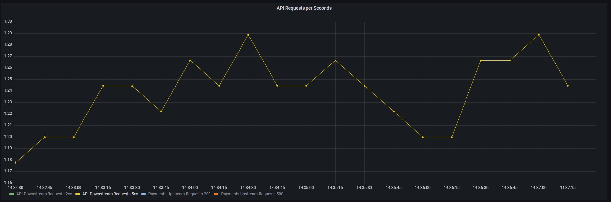
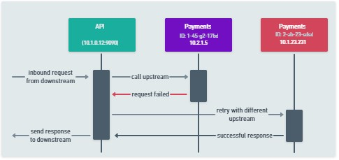
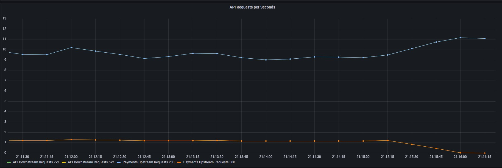
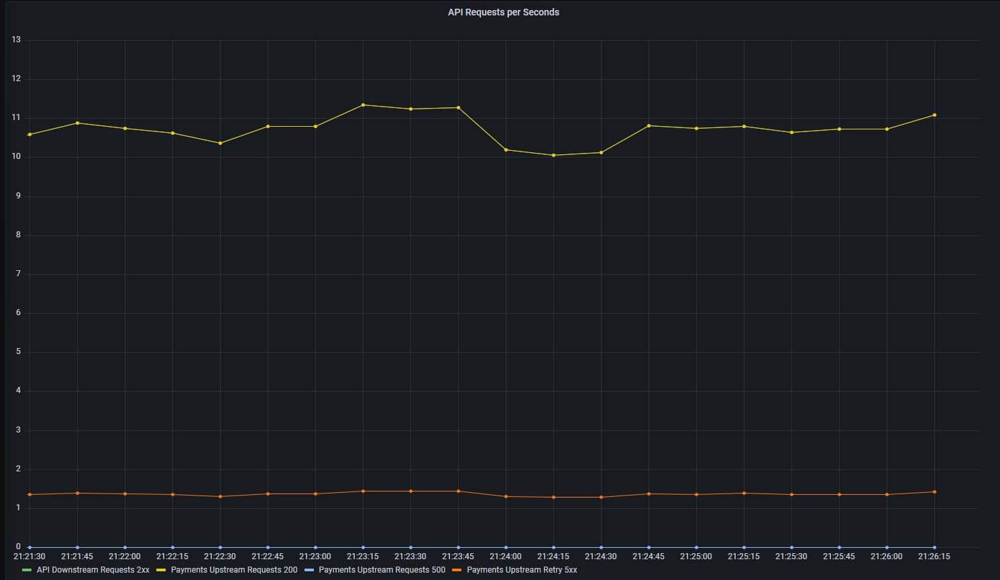

<TerminalVisor minimized="true">
  <Terminal target="tools.container.shipyard.run" shell="/bin/bash" workdir="/" user="root" id="tools" name="Tools"/>
</TerminalVisor>

The payments service in the example application has been configured to deliberately return errors from one of the
service instances. The error rate 20% of all requests from one service, this roughly equals about 1 request per second.

If you look at your API Request chart you will see these errors.

### Figure 4.0 API Downstream errors


In this step we are going to apply a retry that will retry any failed requests, masking the problem from the client
who is calling the `API`.

### Figure 4.1 Retry Pattern


## Applying a retry

You can configure a retry by applying the following configuration, this config is specific to Consul service mesh
but almost every service mesh will have a comparable config.

```yaml
---
apiVersion: consul.hashicorp.com/v1alpha1
kind: ServiceRouter
metadata:
  name: payments
spec:
  routes:
    - match:
        http:
          pathPrefix: /
      destination:
        service: payments
        requestTimeout: 10s
        numRetries: 5
        retryOnConnectFailure: true
        retryOnStatusCodes:
          - 503
          - 500
```

Apply this config using `kubectl`

<TerminalRunCommand target="tools">
  <Command>clear</Command>
  <Command>kubectl apply -f /files/retries.yaml</Command>
</TerminalRunCommand>

```shell
kubectl apply -f /files/retries.yaml
```

After you apply the configuration you will see that the downstream requests that result in a 200 increase by approximately 1 request per second.
This is due to the retry masking the error in the `Payments` service from the end user.

### Figure 4.1 Retries Applied


There is however a problem, there are still errors happening in the system, it is just that the existing metrics are not showing these 
with Retry configuration applied.  To handle this we need to query another metric `envoy_cluster_retry_upstream_rq_xx`.

Edit your `API Requests per Seconds` Panel and add a new query with the following detials.

```
rate(envoy_cluster_retry_upstream_rq_xx{consul_source_service="api", consul_destination_service="payments"}[$__rate_interval])
```

After apply the changes you will now see the Retry statistics shown in your chart. 

### Figure 4.1 Retries per second


## Other Retry Statistics

You have now reached the end of the workshop, we hope you have found it informative. Before you go, why not spend 5 minutes 
investigating some of the other Retry statistics that Envoy produces.

| Name                  | Type    | Description                 |
| --------------------- | ------- | -----------------           |
| upstream_rq_retry | Counter | Total request retries |
| upstream_rq_retry_limit_exceeded | Counter | Total requests not retried due to exceeding the configured number of maximum retries |
| upstream_rq_retry_overflow | Counter | Total requests not retried due to circuit breaking or exceeding the retry budgets |
| upstream_rq_retry_success | Counter | Total request retry successes |
| upstream_rq_time | Histogram | Request time milliseconds |
| upstream_rq_timeout | Counter | Total requests that timed out waiting for a response |
| upstream_rq_total | Counter | Total requests initiated by the router to the upstream |
